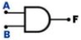

# T04: Compuertas lógicas

Las **Compuertas Lógicas** son circuitos electrónicos conformados internamente por transistores que generan  señales de voltaje como una salida de forma booleana. Las señales de salida se obtienen por operaciones lógicas binarias (suma, multiplicación). También (niegan, afirman, incluyen o excluyen).

> *"Las compuertas lógicas se pueden aplicar en otras áreas como mecánica, hidráulica o neumática"*.
>

- Existen diferentes tipos de compuertas y algunas de estas son más complejas.
- Estas compuertas complejas puedan ser simuladas como compuertas más sencillas.

:::{admonition} ¿Qué es una tabla de la verdad?
:class: tip
Toda **compuerta lógica** tiene tabla de la verdad que explican los comportamientos en sus salidas. Estas salidas dependen del valor booleano que tenga cada una de sus entradas.
:::

---
## Compuerta AND

Esta compuerta es representada por una multiplicación. Indica que es necesario que en todas sus entradas se tenga un estado binario 1 para que la salida otorgue un 1 binario. En caso contrario de que falte alguna de sus entradas con este estado o no tenga si quiera una accionada, la salida no podrá cambiar de estado y permanecerá en 0.

:::{table}

Fórmula|Gráfica
-|-
$F=A*B$|
:::

:::{table} Tabla de la verdad

A|B|F
-|-|-
0|0|0
0|1|0
1|0|0
1|1|1
:::

---
## Compuerta OR

Esta compuerta es representada como una suma. Indica que con cualquiera de sus entradas que este en estado binario `1`, su salida pasara a un estado `1` también. No es necesario que todas sus entradas estén accionadas para conseguir un estado `1` a la salida. Para lograr un estado `0` a la salida, todas sus entradas deben estar en el mismo valor de `0`.

:::{table}

Fórmula|Gráfica
-|-
$F=A+B$|
:::

:::{table} Tabla de la verdad

A|B|F
-|-|-
0|0|0
0|1|1
1|0|1
1|1|1
:::

---
## Compuerta NOT

En este caso esta compuerta solo tiene una entrada y una salida y esta actúa como un inversor. Para esta situación en la entrada se colocara un `1` y en la salida otorgara un `0` y en el caso contrario esta recibirá un `0` y mostrará un `1`. Por lo cual todo lo que llegue a su entrada, será inverso en su salida.

:::{table}

Fórmula|Gráfica
-|-
$F=\overline{A}$|
:::

:::{table} Tabla de la verdad

A|F
-|-
0|1
1|0
:::

---
## Compuerta NAND

También denominada como **AND negada**, esta compuerta trabaja al contrario de una AND ya que al no tener entradas en `1` o solamente alguna de ellas, esta concede un `1` en su salida, pero si esta tiene todas sus entradas en `1` la salida se presenta con un `0`.

:::{table}

Fórmula|Gráfica
-|-
$F=\overline{A*B}$|
:::

:::{table} Tabla de la verdad

A|B|F
-|-|-
0|0|1
0|1|1
1|0|1
1|1|0
:::

---
## Compuerta NOR

La compuerta OR también tiene su versión inversa. Esta compuerta cuando tiene sus entradas en estado `0` su salida estará en `1`, pero si alguna de sus entradas pasa a un estado `1` sin importar en qué posición, su salida será un estado `0`.

:::{table}

Fórmula|Gráfica
-|-
$F=\overline{A+B}$|
:::

:::{table} Tabla de la verdad

A|B|F
-|-|-
0|0|1
0|1|0
1|0|0
1|1|0
:::

---
## Compuerta XOR

También llamada **OR exclusiva**, esta actúa como una suma binaria de un dígito cada uno y el resultado de la suma seria la salida. Otra manera de verlo es que: con valores de entrada igual, el estado de salida es `0` y con valores de entrada diferente, la salida será `1`.

:::{table}

Fórmula|Gráfica
-|-
$F=A*\bar{B}+\bar{A}*B$|
:::

:::{table} Tabla de la verdad

A|B|F
-|-|-
0|0|0
0|1|1
1|0|1
1|1|0
:::

---
## Compuerta XNOR

Esta compuerta es todo lo contrario a la compuerta XOR, ya que cuando las entradas sean iguales se presentara una salida en estado `1` y si son diferentes la salida será un estado `0`.

:::{table}

Fórmula|Gráfica
-|-
$F=\overline{A*\bar{B}+\bar{A}*B}$|
:::

:::{table} Tabla de la verdad

A|B|F
-|-|-
0|0|1
0|1|0
1|0|0
1|1|1
:::

---
## Ejemplo 01: Ejercicio compuertas lógicas

Para la siguiente **fórmula**, exprese su **circuito lógico** e identifique su **tabla de la verdad**.

$$F=\overline{(A*B)}+C$$

### Solución

Para $\overline{(A*B)}$ se tiene la siguiente compuerta lógica:

:::{figure} ./recursos/image12.png
:align: center
:width: 160

Compuerta NAND
:::

A lo anterior se le suma $C$ con la compuerta OR y finalmente se obtiene:

:::{figure} ./recursos/image13.png
:align: center
:width: 370

Circuito lógico 01
:::

Ahora se procede a desarrollar la tabla de la verdad. Para esto identificar el valor de F para las entradas A, B y C. 

Para $A=0$, $B=0$ y $C=0$

$$F=\overline{(A*B)}+C$$
$$F=\overline{(0*0)}+0$$
$$F=\overline{(0)}+0$$
$$F=1+0$$
$$F=1$$

Para $A=0$, $B=0$ y $C=1$

$$F=\overline{(A*B)}+C$$
$$F=\overline{(0*0)}+1$$
$$F=\overline{(0)}+1$$
$$F=1+1$$
$$F=1$$

De esta forma se puede ir llenando la siguiente tabla de la verdad:

:::{table} Tabla de la verdad circuito lógico 01

A|B|C|F
-|-|-|-
0|0|0|`1`
0|0|1|`1`
0|1|0|
0|1|1|
1|0|0|
1|0|1|
1|1|0|
1|1|1|
:::

---
## Ejemplo 02: Ejercicio compuertas lógicas

Para el siguiente **circuito lógico**, exprese su **fórmula** e identifique su **tabla de la verdad**.

:::{figure} ./recursos/image10.png
:align: center
:width: 350

Circuito lógico 02
:::

### Solución

- Se tiene una primera compuerta de tipo **AND** con las entradas A y B.
- Se tiene una segunda compuerta de tipo **OR** con las entradas C y D.
- Las salidas de la primera y segunda compuerta se operan con una compuerta **NOR**.

Esto se modela de la siguiente manera:

:::{figure} ./recursos/image11.png
:align: center
:width: 400

Circuito lógico 02
:::

De estar forma, la formula algebraica que modela el circuito es:

$$F=\overline{(A*B)+(C+D)}$$

Con la formula, ahora es posible obtener la tabla de la verdad. Identificar el valor de F para todas las entradas A, B, C y D.

Para $A=0$, $B=0$, $C=0$ y $D=0$

$$F=\overline{(A*B)+(C+D)}$$
$$F=\overline{(0*0)+(0+0)}$$
$$F=\overline{(0)+(0)}$$
$$F=\overline{(0)}$$
$$F=1$$

Para $A=0$, $B=0$, $C=0$ y $D=1$

$$F=\overline{(A*B)+(C+D)}$$
$$F=\overline{(0*0)+(0+1)}$$
$$F=\overline{(0)+(1)}$$
$$F=\overline{(1)}$$
$$F=0$$

Para $A=0$, $B=0$, $C=1$ y $D=0$

$$F=\overline{(A*B)+(C+D)}$$
$$F=\overline{(0*0)+(1+0)}$$
$$F=\overline{(0)+(1)}$$
$$F=\overline{(1)}$$
$$F=0$$

Para $A=0$, $B=0$, $C=1$ y $D=1$

$$F=\overline{(A*B)+(C+D)}$$
$$F=\overline{(0*0)+(1+1)}$$
$$F=\overline{(0)+(1)}$$
$$F=\overline{(1)}$$
$$F=0$$

De esta forma se puede ir llenando la siguiente tabla de la verdad:

:::{table} Tabla de la verdad circuito lógico 02

A|B|C|D|F
-|-|-|-|-
0|0|0|0|`1`
0|0|0|1|`0`
0|0|1|0|`0`
0|0|1|1|`0`
0|1|0|0|
0|1|0|1|
0|1|1|0|
0|1|1|1|
1|0|0|0|
1|0|0|1|
1|0|1|0|
1|0|1|1|
1|1|0|0|
1|1|0|1|
1|1|1|0|
1|1|1|1|
:::