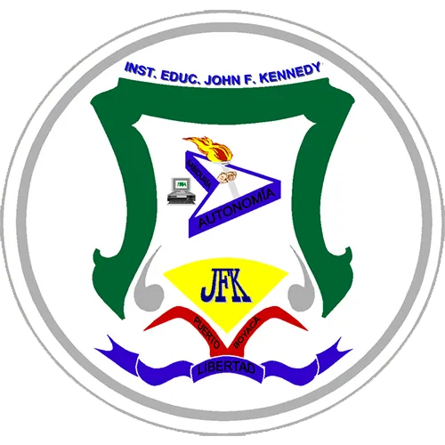

# Periodo 02

:::{list-table}
:header-rows: 0
* - {width=250px}
  - **INSTITUCIÓN EDUCATIVA** John F. Kennedy   **DOCENTE** Julian Camilo Fonseca Romero   **ASIGNATURA** Lógica computacional   **GRADO** NOVENO   **SEMANAS** 10   **TIEMPO DE TRABAJO** 1 hora / semana (10 horas)
:::

:TEMÁTICA: Base en un sistema numérico, sistemas numéricos posicionales y no posicionales. 
:OBJETIVO: Conocer bases comunes de sistemas numéricos y sus reglas para identificar aplicabilidad en códigos de computadoras.
:DESEMPEÑO: Conoce las bases de los sistemas numéricos así como tambíen realiza conversiones entre sistemas numéricos decimales, binarios y hexadecimales.

## Orientaciones curriculares

- **Componente**: 
- **Compotencia**: 
- **Evidencia de aprendizaje**:

## Contenidos

:::{toctree}
:maxdepth: 2

A01.md
A02.md
R02.md
:::